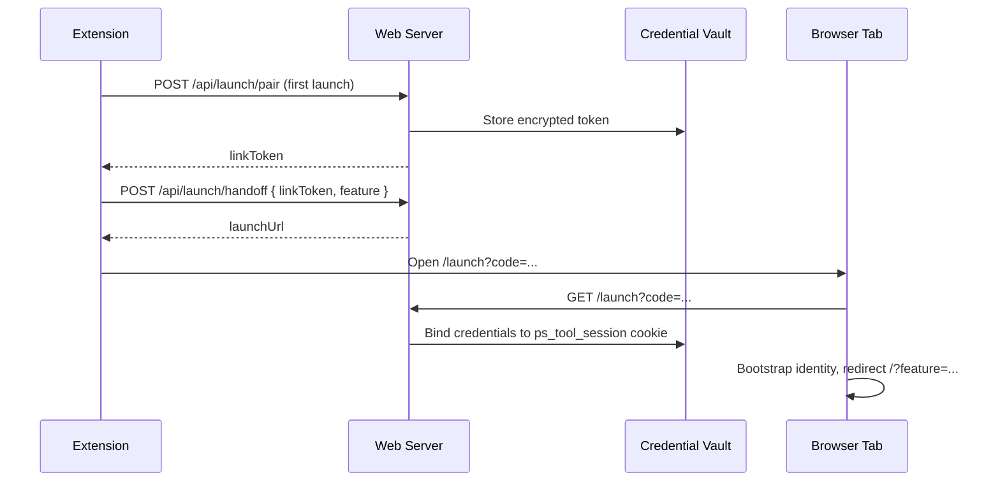

# Launch Endpoint

Secure handoff from the Chrome extension to the PS Tool web app using one-time pairing, opaque link tokens, and a server-side credential vault.

## Overview

The extension reads Genesys Cloud auth from the active tab once per session. On the first feature launch it silently pairs with the web app. After pairing, every launch sends only a `linkToken` — the Genesys bearer token is never repeated in handoff requests.



## Environment

| Variable | Purpose |
| --- | --- |
| `VAULT_ENCRYPTION_KEY` | 32-byte hex key (64 characters) for AES-256-GCM token encryption |
| `LAUNCH_HMAC_SECRET` | Optional HMAC secret for signed extension requests (recommended in production) |
| `LAUNCH_BASE_URL` | Public base URL for launch redirects (defaults to request host) |
| `LAUNCH_VAULT_TTL_MS` | Vault entry lifetime (default 8 hours) |
| `LAUNCH_CODE_TTL_MS` | One-time launch code lifetime (default 60 seconds) |

Generate a vault key:

```bash
node -e "console.log(require('crypto').randomBytes(32).toString('hex'))"
```

## API

### `POST /api/launch/pair`

One-time pairing. Validates org and user against Genesys API before storing credentials.

```json
{
  "region": "us-east-1",
  "token": "<bearer>",
  "orgId": "<uuid>",
  "userId": "<uuid>"
}
```

Response:

```json
{
  "linkToken": "<opaque>",
  "org": { "id": "...", "name": "..." },
  "user": { "id": "...", "username": "...", "name": "..." },
  "expiresAt": 1234567890
}
```

### `POST /api/launch/handoff`

Every feature launch after pairing.

```json
{
  "linkToken": "<from chrome.storage.local>",
  "feature": "genesys-users",
  "params": { "conversationId": "abc-123" }
}
```

Response:

```json
{
  "code": "a1b2c3d4",
  "launchUrl": "http://localhost:3000/launch?code=a1b2c3d4"
}
```

### `POST /api/launch/unpair`

Revokes a link token and vault entry.

### `GET /launch?code=...`

Consumes a one-time code, binds vault credentials to the `ps_tool_session` cookie, writes org/user identity to `localStorage` (not the Genesys token), and redirects to `/?feature=<feature>`.

### `POST /api/launch/disconnect`

Clears session-scoped vault credentials for the current browser session.

## Security Model

| Control | Detail |
| --- | --- |
| Token transit | Genesys bearer sent once at pair time over HTTPS |
| Vault storage | AES-256-GCM encrypted token in SQLite; link tokens stored as SHA-256 hashes |
| Session binding | Launch code binds vault entry to `ps_tool_session` cookie |
| Web API calls | Vault mode uses session cookie only; `x-genesys-token` header stripped client-side |
| Schema validation | Allowlisted fields; unknown keys rejected |
| Feature allowlist | Only known `genesys-*` feature IDs accepted |
| Body size limit | 4 KB on launch POST routes |
| Rate limiting | pair 10/15min, handoff 60/15min, GET /launch 30/15min per IP |
| HMAC signing | Optional `X-PS-Tool-Timestamp` + `X-PS-Tool-Signature` headers |
| Bootstrap | Server-side JSON.stringify of escaped bootstrap payload; no reflected user input |
| Logging | Tokens and link tokens are never logged |

**HTTPS policy:** Required outside `localhost` / `127.0.0.1`.

## Extension Setup

1. Load unpacked from `extension/` in Chrome.
2. Open extension options and set PS Tool base URL (default `http://localhost:3000`).
3. Optionally set `Launch HMAC secret` to match `LAUNCH_HMAC_SECRET` in `.env`.
4. Open a Genesys Cloud tab with an active session.
5. Click the extension icon to open the side panel.
6. Click any export or bulk button — first click pairs silently, then opens the web app on the target feature.

Quick Navigation buttons open Genesys admin URLs directly and do not use the launch endpoint.

## Feature Mapping

See [`docs/migration-matrix.md`](migration-matrix.md) and `extension/js/constants.js` for button ID → `feature` param mappings.

Conversation features accept an optional `conversationId` param:

- `genesys-report-conversation`
- `genesys-report-interaction`
- `genesys-report-flow`

## Testing

```bash
npm test
```

The launch security script validates schema rules, HMAC verification, encryption round-trips, and rate limiter behavior without a running server.
